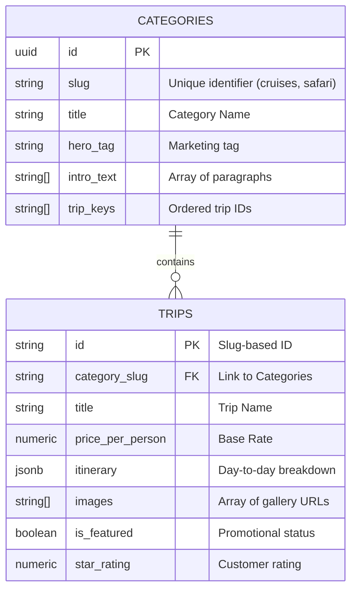

# 🏺 Route d'Égypte — Luxury Tourism Platform

[](https://react.dev/)
[](https://vitejs.dev/)
[](https://supabase.com/)
[](https://tailwindcss.com/)
[](https://www.framer.com/motion/)

> A premium, multilingual travel experience designed for the modern explorer. Route d'Égypte offers an editorial-style digital gateway to the wonders of the Nile and beyond.

---

## 📸 Visual Journey

| Desktop Experience | Mobile Excellence |
| :---: | :---: |
|  |  |
| *High-end animations & scroll-triggered reveal* | *Snappy, touch-first interactions* |

---

## ✨ Key Features

- **🚀 Performance First**: Built with Vite and React 19 for instantaneous load times and a fluid UI.
- **🎨 Editorial Design**: A curated visual experience using a bespoke design system and high-fidelity typography.
- **🌊 Fluid Motion**: Integrated **Framer Motion** for scroll-triggered reveals, animated counters, and page transitions.
- **🌍 Internationalization**: Full multi-language support (English/French/Arabic) powered by `react-i18next`.
- **⚡ Real-time Backend**: Powered by **Supabase** for dynamic content delivery and secure database management.
- **📱 Responsive Layout**: A mobile-first approach ensuring a premium experience across all devices.

---

## 📊 Database Architecture

The data layer is architected for scalability and rich content delivery. Below is the Entity-Relationship Diagram (ERD) representing our core schema.



---

## 🛠️ Tech Stack & Tools

| Category | Technology | Icon |
| :--- | :--- | :---: |
| **Frontend** | React + Vite | ⚛️ |
| **Styling** | Tailwind CSS 4.0 | 🎨 |
| **Animations** | Framer Motion | ✨ |
| **Database** | Supabase (PostgreSQL) | ⚡ |
| **Translation** | i18next | 🌐 |
| **Icons** | Lucide React | 🛡️ |

---

## 🚀 Getting Started

### Prerequisites

- Node.js (Latest LTS)
- npm or yarn
- A Supabase Project

### Installation

1. **Clone the repository**
   ```bash
   git clone https://github.com/MoaazHF/Route-DEgypte.git
   cd Route-DEgypte
   ```

2. **Install dependencies**
   ```bash
   npm install
   ```

3. **Environment Setup**
   Create a `.env` file in the root and add your Supabase credentials:
   ```env
   VITE_SUPABASE_URL=your_project_url
   VITE_SUPABASE_ANON_KEY=your_anon_key
   ```

4. **Run the development server**
   ```bash
   npm run dev
   ```

---

## 🏗️ Project Structure

```text
├── src/
│   ├── components/     # UI Components (MotionReveal, Counter, etc.)
│   ├── hooks/          # Custom React hooks
│   ├── translations/   # i18n JSON files
│   ├── App.jsx         # Main routing and layout
│   └── main.jsx        # Entry point
├── supabase/
│   ├── schema.sql      # Database definitions
│   └── seed-data.sql   # Initial project data
└── public/             # Static assets
```

---

## 📧 Contact & Support

**MoaazHF** - [GitHub](https://github.com/MoaazHF)  
Project Link: [https://github.com/MoaazHF/Route-DEgypte](https://github.com/MoaazHF/Route-DEgypte)

---

<p align="center">
  Developed with ❤️ for the beauty of Egypt.
</p>
